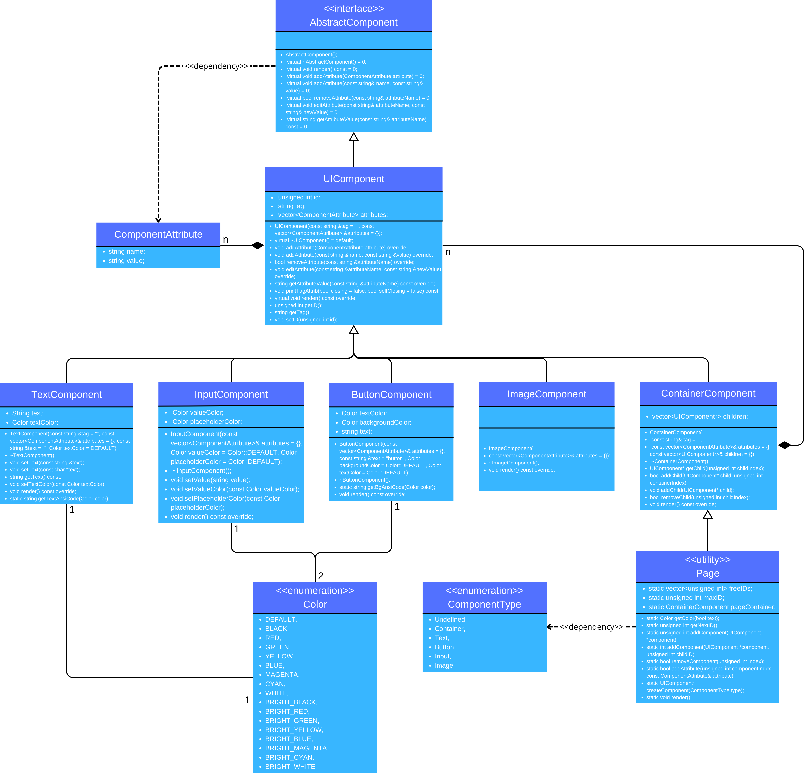

# UI Component System

This project implements a pseudo markup language code generator, where you can create, manage, and render (print in terminal) various types of UI components. The core classes and structures are designed to manage components such as `Container`, `Text`, `Button`, `Input`, and `Image`. These components can be added to a page, manipulated, and rendered (printed to terminal in text form).

Keep in mind that is is but a pseudo language and even though it is technically compatible with HTML, the correctness of final code is up to the user and user and moreover it is highly recommended for user to add !DOCTYPE tag as it is not part of the language structure and it should be included.

## Project description

Mějme systém pro tvorbu jednoduché webové stránky složené z textových a interaktivních komponent. Webová stránka je tvořena jedním hlavním kontejnerem (tzv. `pageContainer`), do kterého lze přidávat další komponenty nebo vnořené kontejnery.

- Komponenty lze přidávat, odebírat a upravovat jejich atributy (např. classy, style, velikost, zarovnání).
- Komponenty se dělí na následující typy:
  - `Container` – slouží jako kontejner pro další komponenty
  - `Text` – obsahuje text
  - `Button` – tlačítko
  - `Input` – vstupní pole
  - `Image` – obrázek

### Funkcionalita

- Komponenty jsou identifikovány jedinečnými ID, která systém automaticky přiděluje.
- Komponenty lze vkládat buď přímo na stránku, nebo do vnořených kontejnerů.
- Komponenty lze odebrat pomocí jejich ID.
- Každé komponentě lze přiřadit libovolný počet atributů ve formě dvojic *název, hodnota*.
- Systém umožňuje vypsat (vykreslit) aktuální stav stránky v textové podobě.
- Komponenty lze vyhledat podle jejich ID a upravovat jejich atributy.
- Komponenty mají předdefinované vlastnosti dle svého typu, které nelze měnit:
  - ID komponenty
  - Typ komponenty (Text, Button, ...)

### Uživatelské rozhraní

Program běží v textovém režimu a uživatel má k dispozici následující akce:

<pre lang="markdown"> ``` 0 | Render your current website 1 | Add Container component 2 | Add Text component 3 | Add Button component 4 | Add Input component 5 | Add Image component 6 | Add attribute to component 7 | Remove component -1 | End program ``` </pre>

## Project Structure

The project is organized into multiple header and source files, each corresponding to a specific component or class within the system.

### File Structure

```
./
│
├── AbstractComponent.cpp         # Implementation of the AbstractComponent class
├── UIComponent.cpp               # Implementation of the UIComponent class
├── ContainerComponent.cpp        # Implementation of the ContainerComponent class
├── TextComponent.cpp             # Implementation of the TextComponent class
├── ButtonComponent.cpp           # Implementation of the ButtonComponent class
├── InputComponent.cpp            # Implementation of the InputComponent class
├── ImageComponent.cpp            # Implementation of the ImageComponent class
├── Page.cpp                      # Implementation of the Page class
│
├── AbstractComponent.h           # Header for the AbstractComponent class
├── UIComponent.h                 # Header for the UIComponent class
├── ContainerComponent.h          # Header for the ContainerComponent class
├── TextComponent.h               # Header for the TextComponent class
├── ButtonComponent.h             # Header for the ButtonComponent class
├── InputComponent.h              # Header for the InputComponent class
├── ImageComponent.h              # Header for the ImageComponent class
├── Page.h                        # Header for the Page class
│
├── main.cpp                      # Main entry point for running the UI system
│
├── input.input                   # Input file for executable
|
└── ClassDiagram.png              # Class diagram - visual representation of inner structure

```

### Core Components

1. **`AbstractComponent`**
   Fully abstract class used as a template for deriving (child) classes
   
3. **`UIComponent`**  
   The base class for all UI components. It defines the common interface that all components should implement.

4. **`ContainerComponent`**  
   A specialized `UIComponent` class that can contain other components, managing their layout and rendering.

5. **`TextComponent`**  
   A simple component that represents a block of text. It includes basic rendering and text manipulation functionality.

6. **`ButtonComponent`**  
   A component that represents a button with click functionality. It can render a label and handle user input.

7. **`InputComponent`**  
   A component for accepting text input from the user. It manages cursor position and text entry.

8. **`ImageComponent`**  
   A component that represents an image. It is capable of rendering an image to the screen.

9. **`Page`**  
   A static class that manages a collection of UI components on a single page. It supports adding, removing, and rendering components.

### Key Classes and Methods

- **`Page`**:  
  - `static unsigned int getNextID()`: Returns the next available component ID.
  - `static unsigned int addComponent(UIComponent* component)`: Adds a component to the page and returns its ID.
  - `static bool removeComponent(unsigned int index)`: Removes a component from the page using its ID.
  - `static void render()`: Renders all components on the page.

- **`UIComponent` (Base Class)**:  
  - A base class that defines common functionality for all UI components.

- **Component Types**:  
  - `Container`: A container component that holds other components.
  - `Text`: A component for displaying text.
  - `Button`: A clickable button component.
  - `Input`: A text input component.
  - `Image`: A component for displaying an image.

### Class diagram




### Design Notes

- **Static Page Management**:  
  The `Page` class is designed as a static manager of components, with methods for adding, removing, and rendering components. The static nature ensures a single page is shared across the entire application.

- **Component Types**:  
  Components are identified by unique IDs, and different types (text, button, etc.) can be dynamically created and added to the page. Each component is a derived class of `UIComponent`.

- **Color Management**:  
  The `getColor()` function is used for managing colors for text components.

### Dependencies

- C++11 or later

### Building and Running

1. **Build**:  
   To build the project, use a C++ compiler (e.g., `g++`) to compile the source files. Ensure that all source files are compiled together:

   ```bash
   g++ *.cpp -o main
   ```

2. **Run**:  
   After building, you can run the program:

   ```bash
   ./main
   ```

   Or run it with default input

   ```bash
   ./main < input.input
   ```

### Future Improvements

- **Layouts**:  
  Improve the container component with more flexible layout management.

- **More Component types**:
  Adding more component types like link, source or anchor

- **Generating file**:
  Adding function to generate markup language source file

### License

This project is open source and available for personal or academic use. Feel free to contribute!
